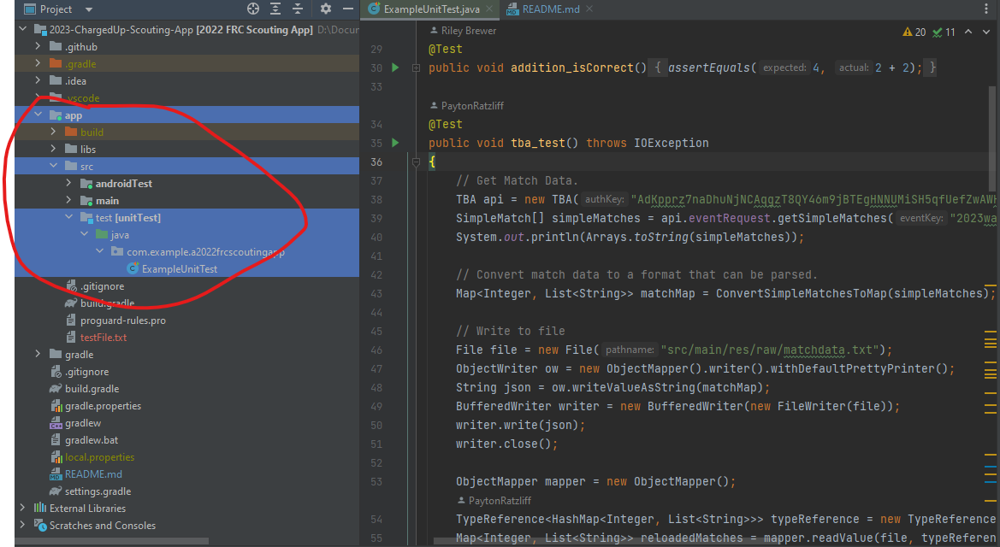
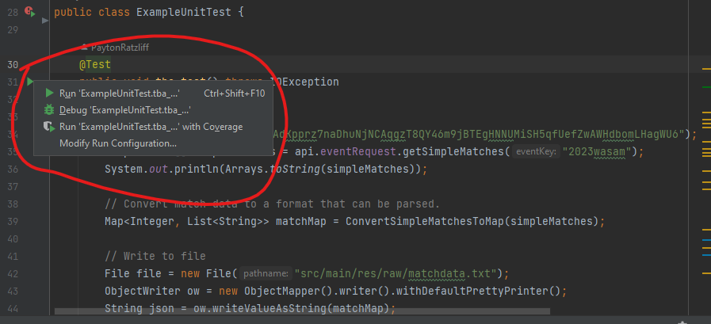
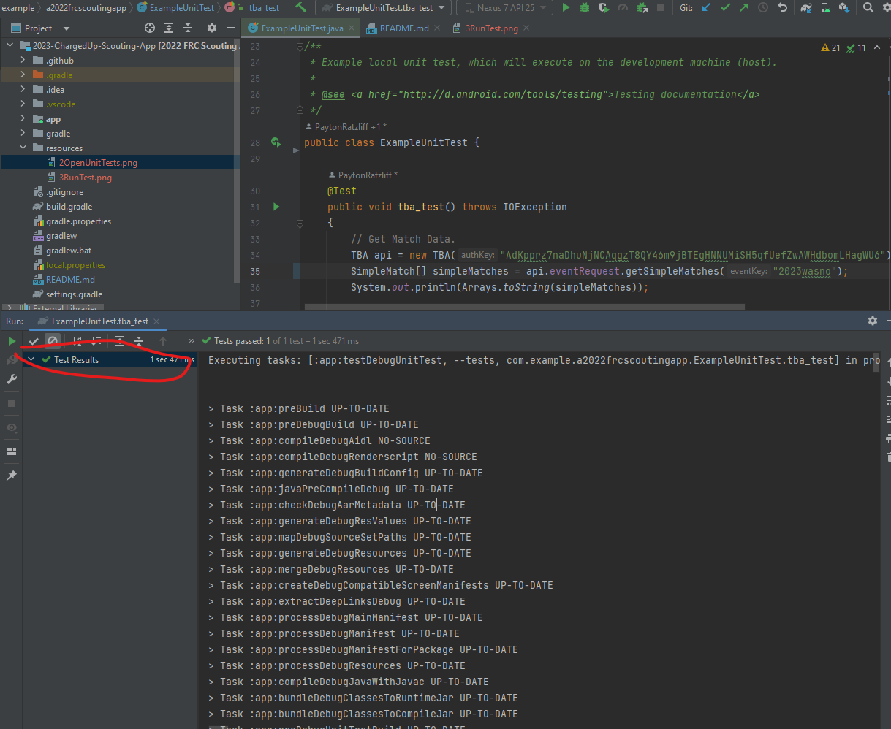
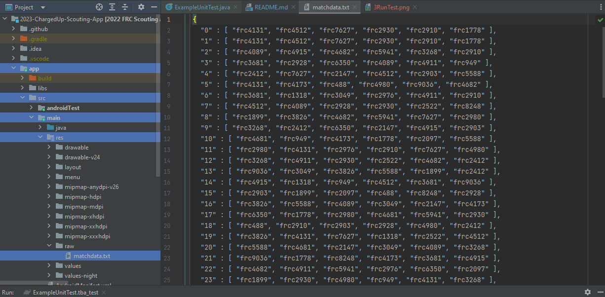
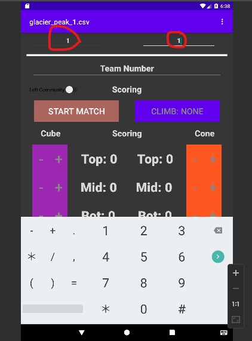
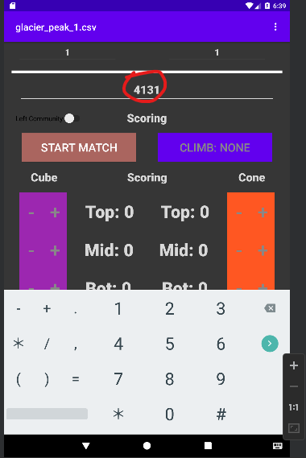

# 2022-Rapid-React-Scouting-App
The app we used to scout for the 2023 frc season.  ͡❛ ͜ʖ ͡❛ ͡❛ ͜ʖ ͡❛ ͡❛ ͜ʖ ͡❛ ͡❛ ͜ʖ ͡❛ ͡❛ ͜ʖ ͡❛ ͡❛ ͜ʖ ͡❛ ͡❛ ͜ʖ ͡❛
It is made to be used on Kindles or other android devices.

# Setup
Using [The Blue Alliance API](https://www.thebluealliance.com/apidocs) and a [GitHub Library for it](https://github.com/RaiderRobotix/blue-alliance-api-java-library)

# Loading The Blue Alliance Match Data.

1. Ensure match data is available on The Blue Alliance
   - Sammamish Example: https://www.thebluealliance.com/event/2023wasam
2. Open "ExampleUnitTest.java" in /app/src/test/java/com.example.a2022frcscoutingapp
   
3. Run the `tba_test()` test by clicking the green arrow next to the test, then clicking "Run 'ExampleUnitTest.tba_..." (the first option) in the pop-up window.
   
4. Wait for the tests to run and ensure that they succeed by checking the "Test Results" section on the left side of the test window.
   
5. Verify that match data exists in /app/src/main/res/raw/matchdata.txt (Note: The below example contains data for Glacier Peak. Your entries should have different team numbers).
   
6. Download the Scouting App to the tablets.
7. Set the "Tablet ID" to the ID for the tablet (a number between 1 and 6) and the "Match Number" to 1.
   
8. Tap the "Team Number" field (it may require two presses). It should automatically update with a team number.
   
9. After saving match results, the "Team Number" field should automatically update along with the "Match Number" field.